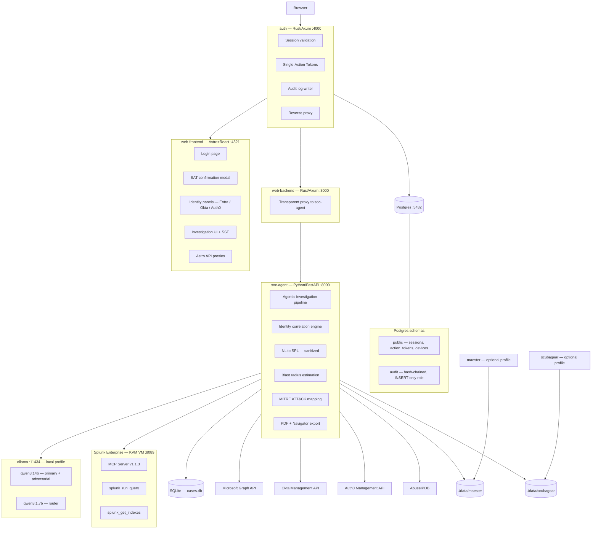
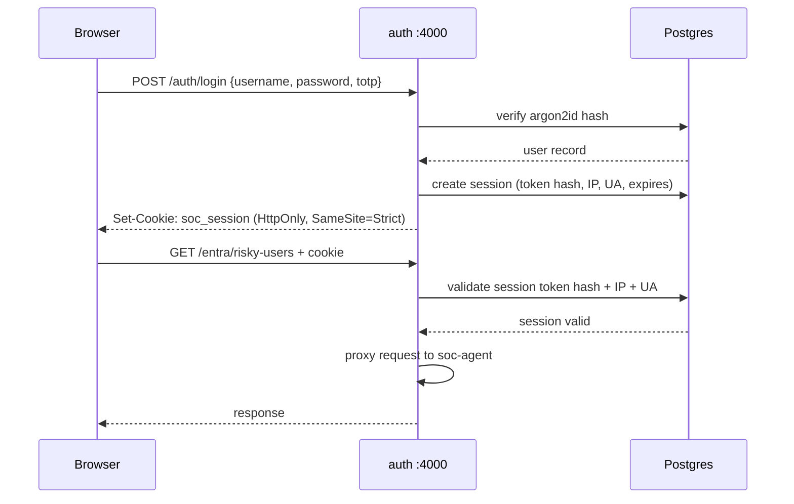
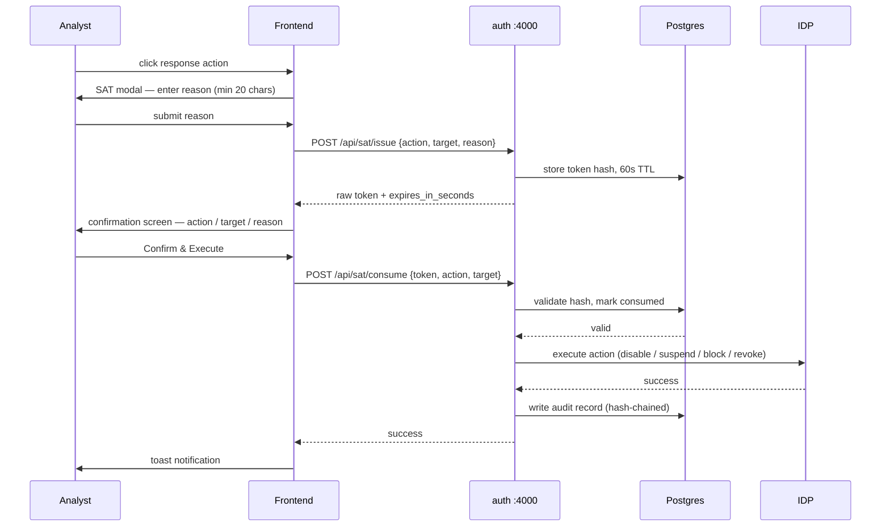
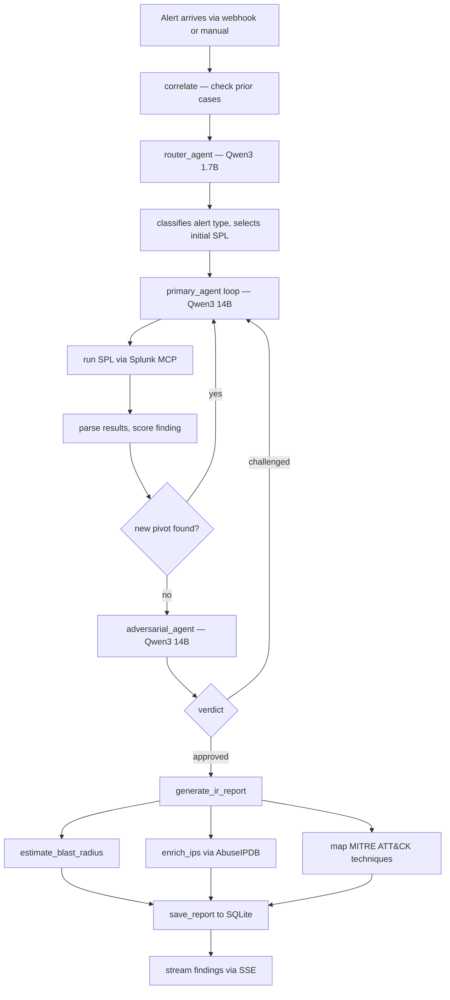
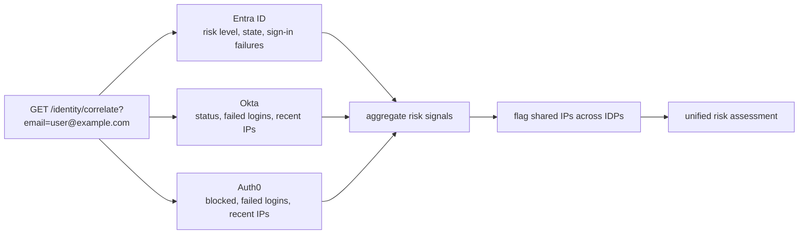

# Architecture — TriagaSOAR

---

## System diagram



---

## Auth layer



---

## Single-Action Token flow



---

## Investigation pipeline



---

## Identity correlation



---

## Container details

### auth (port 4000)

- **Stack:** Rust, Axum, sqlx, argon2, totp-rs, sha2

**Session properties**

- 32-byte CSPRNG opaque tokens, Argon2id-hashed at rest
- HttpOnly, SameSite=Strict cookies
- 30-minute absolute expiry, no sliding window
- IP address and user agent binding: either changes, session is invalidated
- One concurrent session per user: new login kills the previous one

**Authentication tiers**

| Level | Required for |
|-------|-------------|
| L1 (password + TOTP) | Read access, view cases and reports |
| L2 (L1 + re-auth prompt) | Run investigations, query Splunk |
| L3 (L1 + hardware key) | Any response action, SAT required per action |

**Audit log**

- Separate `audit` Postgres schema with a dedicated INSERT-only DB role
- Application cannot modify or delete its own audit records
- Each entry contains SHA-256 of the previous entry (hash-chained)
- Chain integrity verifiable at any time via `GET /audit/verify`

---

### web-frontend (port 4321)

- **Stack:** Astro (SSR), React, Geist Mono, Recharts
- **Auth:** Astro middleware redirects unauthenticated requests to `/login`
- **Astro API routes:** `/api/login`, `/api/sat/issue`, `/api/sat/consume` proxy server-side to auth, forwarding cookies. Browser never talks directly to port 4000.

**Pages**

| Route | Description |
|-------|-------------|
| `/login` | Login page |
| `/` | Case list |
| `/dashboard` | SOC statistics |
| `/investigate` | Manual alert submission |
| `/search` | Natural language SPL |
| `/timeline` | Case timeline |
| `/patterns` | 21 attack patterns + 9 EDR evasion hunts |
| `/compare` | Side-by-side case diff |
| `/health` | Splunk index health |
| `/entra` | Entra ID panel |
| `/okta` | Okta panel |
| `/auth0` | Auth0 panel |
| `/maester` | Maester M365 baseline results |
| `/scubagear` | ScubaGear CISA baseline results |
| `/attackers/[ip]` | Attacker profile across all cases |
| `/cases/[id]` | Full case detail |

---

### soc-agent (port 8000)

- **Stack:** Python, FastAPI, SQLite, httpx, WeasyPrint

**Key modules**

| File | Responsibility |
|------|---------------|
| `main.py` | FastAPI app, all route handlers, identity correlation |
| `agent.py` | Router + primary agent loop |
| `streaming.py` | SSE generator |
| `blast_radius.py` | Affected IPs, users, hosts |
| `report.py` | Structured IR report assembly |
| `database.py` | SQLite: cases, entities, verdicts, queue |
| `patterns.py` | 21 attack patterns + 9 EDR evasion hunts |
| `threat_intel.py` | AbuseIPDB lookups with cache |
| `splunk_mcp.py` | MCP client wrapper |
| `monitor.py` | Saved search polling loop |
| `llm_client.py` | Ollama / cloud LLM abstraction |
| `entra.py` | Microsoft Graph API client |
| `okta.py` | Okta Management API client |
| `auth0.py` | Auth0 Management API client |

**NL to SPL security controls**

- User input placed in a separate LLM message, not interpolated into system instructions
- Input validated against injection pattern blocklist before LLM sees it
- Generated SPL validated before execution: expected index check, dangerous command ban (exec, script, runshellscript, sendemail, outputlookup, collect), 1000-character cap

---

### maester — optional profile

- **Stack:** PowerShell 7.4, Maester 2.1.0
- **Auth:** Client secret against Entra ID
- **Scope:** Entra ID, Teams, Exchange Online, SharePoint
- **Output:** JSON written to `./data/maester/`, read by soc-agent

---

### scubagear — optional profile

- **Stack:** PowerShell 7, ScubaGear, Linux-patched
- **Patch:** `patch_windows_principal.py` removes `WindowsIdentity` and `WindowsPrincipal` calls at build time. OPA binary symlinked to `opa_linux_amd64_static`. Patch submitted upstream to CISA.
- **Scope:** AAD product only (Teams and Exchange blocked by Unix X509Store limitation)
- **Output:** JSON written to `./data/scubagear/`, read by soc-agent

---

## Storage

| Store | Location | Contents |
|-------|----------|---------|
| SQLite | `./data/cases.db` | Cases, entities, verdicts, triage queue, threat intel cache |
| Postgres | Docker volume `postgres_data` | Sessions, action tokens, devices, audit log |
| Ollama models | Docker volume `ollama_data` | Model weights |
| Maester output | `./data/maester/` | latest.json, status.json |
| ScubaGear output | `./data/scubagear/` | latest.json, status.json |

---

## Ports

| Service | Port | Externally reachable |
|---------|------|---------------------|
| auth | 4000 | Yes (single entry point) |
| web-frontend | 4321 | Via auth proxy |
| web-backend | 3000 | Via auth proxy |
| soc-agent | 8000 | Via auth proxy |
| ollama | 11434 | Via auth proxy |
| postgres | 5432 | Internal only |

---

## Profiles

| Profile | Services |
|---------|---------|
| `local` | ollama, soc-agent-local, web-backend, web-frontend, auth, postgres |
| `cloud` | soc-agent-cloud, web-backend, web-frontend, auth, postgres |
| `maester` | maester (additive) |
| `scubagear` | scubagear (additive) |

---

## Deployment

```bash
# Start with local GPU (pulls Ollama models automatically)
make up

# Start with cloud LLM (OpenAI / Anthropic)
make up-cloud

# Rebuild and restart (local)
make rebuild

# Rebuild and restart (cloud)
make rebuild-cloud

# Stop everything
make down

# Pull Ollama models without restarting
make pull-models

# View soc-agent logs
make logs

# Run demo scenario (resets DB + fires attack simulation)
make demo

# Reset case database only
make reset-db

# Run attack simulation
make attack

# Run a raw Splunk query
make query Q="index=main | head 10"

# Splunk VM (KVM)
sudo virsh start splunk-lab
```